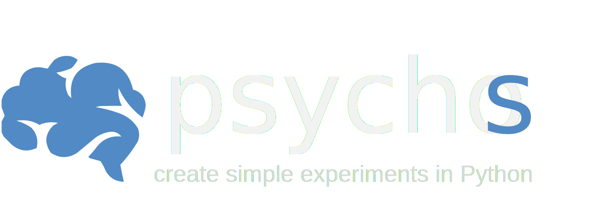

.. meta::
   :title: Psychos: A Python Library for Timing-Sensitive Behavioral Experiments
   :description: Psychos is a lightweight, modern Python library for creating precise, timing-sensitive behavioral experiments, designed for cognitive neuroscience and related fields.
   :keywords: Python, behavioral experiments, cognitive neuroscience, timing-sensitive, research, library, Psychos, open-source
   :author: DMF Group, University of Barcelona
   :copyright: 2024, DMF Group
   :robots: index, follow
   :google-site-verification: NZnC_LS6qshTL2R0ilSswIJiof6k79det1tHayw-8O4

.. image:: ./assets/psychos.svg
  :alt: psychos
  :target: https://github.com/memory-formation/psychos/
  :class: only-light

.. image:: https://badge.fury.io/py/psychos.svg
   :target: https://pypi.org/project/psychos/
   :alt: PyPI version

.. image:: https://readthedocs.org/projects/psychos/badge/?version=latest
    :target: https://psychos.readthedocs.io/en/latest/?badge=latest
    :alt: Documentation Status

.. image:: https://img.shields.io/pypi/pyversions/psychos
   :target: https://pypi.org/project/psychos/
   :alt: PyPI - Python Version

.. image:: https://img.shields.io/badge/license-MIT-green.svg
   :target: https://github.com/memory-formation/psychos/blob/main/LICENSE
   :alt: License

.. image:: https://img.shields.io/badge/platform-Windows%20|%20OS%20X%20|%20Linux-blue.svg
   :target: https://pypi.org/project/psychos/
   :alt: Platform

.. image:: https://img.shields.io/badge/based%20on-Pyglet-orange.svg
   :target: https://pyglet.org/
   :alt: Based on Pyglet

.. image:: https://www.repostatus.org/badges/latest/wip.svg
   :alt: Project Status: WIP - Initial development is in progress, but there has not yet been a stable, usable release suitable for the public.
   :target: https://www.repostatus.org/#wip

----------------

**Psychos** is a modern, lightweight Python library for creating precise, timing-sensitive behavioral
experiments—designed for cognitive neuroscience and related fields. 
Built for ease of use, the library simplifies the coding process, 
allowing researchers to create experiments with clear and readable code.

Content
-------

.. toctree::
   :maxdepth: 1

   content/installation
   content/modules
   content/license

Installation
------------

You can install **Psychos** with pip:

.. code-block:: bash

    pip install psychos

Issues
------

If you encounter any issues or have suggestions for improvements, please 
`open an issue <https://github.com/memory-formation/psychos/issues>`_ on GitHub. 
We greatly value your feedback and contributions to make **Psychos** better!

Contributing
------------

**Psychos** is maintained by `DMF Group <https://brainvitge.org/groups/memory_formation/>`_ at 
the `University of Barcelona <https://web.ub.edu/en/web/ub/>`_. If you would like to contribute, 
please open an issue or submit a pull request on GitHub. We welcome contributions from the community!

License
-------

**Psychos** is licensed under the MIT License. See the :doc:`content/license`  file for more details.

Index
-----

For a complete overview of all available classes, functions, and modules in **Psychos**, please refer to the :ref:`genindex`. 
